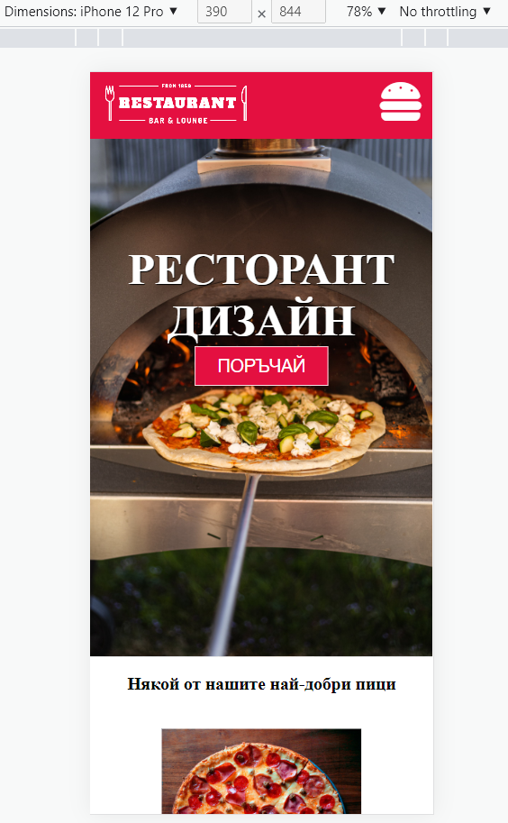
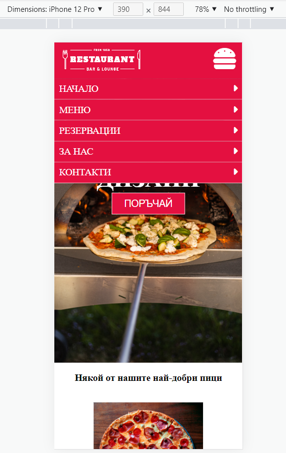

# See my Restourant menu website
https://idinovski.github.io/Restourant-website/

# About the project
A restourant menu website which provides details of the application to the end user like the desscription of the website,
about the restourant, a section that displays the menu and footer with contact form. 
The website is not responsive, the right resolution is 390x844 (iPhone 12 pro)

# Used tools
The website is made with HTML5,CSS and little bit javascript for the burgermenu.

# Screenshots

